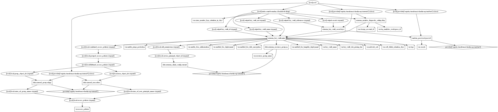

# Azure Key Vault Terraform Module

Azure Key Vault is a tool for securely storing and accessing secrets. A secret is anything that you want to tightly control access to, such as API keys, passwords, or certificates. A vault is a logical group of secrets.

This Terraform Module creates a Key Vault also adds required access policies for azure AD users, groups and azure AD service principals. This also enables private endpoint and sends all logs to log analytic workspace or storage.

## Resources Supported

* [Acess Polices for AD users, groups and SPN](https://registry.terraform.io/providers/hashicorp/azurerm/latest/docs/resources/key_vault_access_policy)
* [Secrets](https://registry.terraform.io/providers/hashicorp/azurerm/latest/docs/resources/key_vault_secret)
* [Certifiate Contacts](https://registry.terraform.io/providers/hashicorp/azurerm/latest/docs/resources/key_vault#contact)
* [Private Endpoints](https://www.terraform.io/docs/providers/azurerm/r/private_endpoint.html)
* [Private DNS zone for `privatelink` A records](https://www.terraform.io/docs/providers/azurerm/r/private_dns_zone.html)
* [Azure Log Dignostics](https://www.terraform.io/docs/providers/azurerm/r/network_security_group.html)

## Module Usage

```terraform
# Azurerm Provider configuration
provider "azurerm" {
  features {}
}

module "key-vault" {
  source  = "kumarvna/key-vault/azurerm"
  version = "2.2.0"

  # By default, this module will not create a resource group and expect to provide 
  # a existing RG name to use an existing resource group. Location will be same as existing RG. 
  # set the argument to `create_resource_group = true` to create new resrouce.
  resource_group_name        = "rg-shared-westeurope-01"
  key_vault_name             = "demo-project-shard"
  key_vault_sku_pricing_tier = "premium"

  # Once `Purge Protection` has been Enabled it's not possible to Disable it
  # Deleting the Key Vault with `Purge Protection` enabled will schedule the Key Vault to be deleted
  # The default retention period is 90 days, possible values are from 7 to 90 days
  # use `soft_delete_retention_days` to set the retention period
  enable_purge_protection = false
  # soft_delete_retention_days = 90

  # Access policies for users, you can provide list of Azure AD users and set permissions.
  # Make sure to use list of user principal names of Azure AD users.
  access_policies = [
    {
      azure_ad_user_principal_names = ["user1@example.com", "user2@example.com"]
      key_permissions               = ["get", "list"]
      secret_permissions            = ["get", "list"]
      certificate_permissions       = ["get", "import", "list"]
      storage_permissions           = ["backup", "get", "list", "recover"]
    },

    # Access policies for AD Groups
    # to enable this feature, provide a list of Azure AD groups and set permissions as required.
    {
      azure_ad_group_names    = ["ADGroupName1", "ADGroupName2"]
      key_permissions         = ["get", "list"]
      secret_permissions      = ["get", "list"]
      certificate_permissions = ["get", "import", "list"]
      storage_permissions     = ["backup", "get", "list", "recover"]
    },

    # Access policies for Azure AD Service Principlas
    # To enable this feature, provide a list of Azure AD SPN and set permissions as required.
    {
      azure_ad_service_principal_names = ["azure-ad-dev-sp1", "azure-ad-dev-sp2"]
      key_permissions                  = ["get", "list"]
      secret_permissions               = ["get", "list"]
      certificate_permissions          = ["get", "import", "list"]
      storage_permissions              = ["backup", "get", "list", "recover"]
    }
  ]

  # Create a required Secrets as per your need.
  # When you Add `usernames` with empty password this module creates a strong random password
  # use .tfvars file to manage the secrets as variables to avoid security issues.
  secrets = {
    "message" = "Hello, world!"
    "vmpass"  = ""
  }

  # (Optional) To enable Azure Monitoring for Azure Application Gateway 
  # (Optional) Specify `storage_account_id` to save monitoring logs to storage. 
  log_analytics_workspace_id = var.log_analytics_workspace_id
  #storage_account_id         = var.storage_account_id

  # Adding additional TAG's to your Azure resources
  tags = {
    ProjectName  = "demo-project"
    Env          = "dev"
    Owner        = "user@example.com"
    BusinessUnit = "CORP"
    ServiceClass = "Gold"
  }
}
```

## Configure Azure Key Vault firewalls and virtual networks

Configure Azure Key Vault firewalls and virtual networks to restrict access to the key vault. The virtual network service endpoints for Key Vault (Microsoft.KeyVault) allow you to restrict access to a specified virtual network and set of IPv4 address ranges.

Default action is set to `Allow` when no network rules matched. A `virtual_network_subnet_ids` or `ip_rules` can be added to `network_acls` block to allow request that is not Azure Services.

```hcl
module "key-vault" {
  source  = "kumarvna/key-vault/azurerm"
  version = "2.2.0"

  # .... omitted

  network_acls = {
    bypass                     = "AzureServices"
    default_action             = "Deny"

    # One or more IP Addresses, or CIDR Blocks to access this Key Vault.
    ip_rules                   = ["123.201.18.148"]

    # One or more Subnet ID's to access this Key Vault.
    virtual_network_subnet_ids = []
  }
  
# ....omitted

}
```

## Key Vault Advanced Access Policies

### `enabled_for_deployment`

To use Key Vault with Azure Resource Manager virtual machines, the `enabled_for_deployment` property on Key Vault must be set to `true`. This access is enabled by default for this module. Incase you want to disable it set the argument `enabled_for_deployment = "false"`.

### `enabled_for_disk_encryption`

We can configure Azure Disk Encryption to use Azure Key Vault to control and manage disk encryption keys and secrets. This access is enabled by default for this module. Incase you want to disable it set the argument `enabled_for_disk_encryption = "false"`.

> Warning: The key vault and VMs must be in the same subscription. Also, to ensure that encryption secrets don't cross regional boundaries, Azure Disk Encryption requires the Key Vault and the VMs to be co-located in the same region. Create and use a Key Vault that is in the same subscription and region as the VMs to be encrypted.

### `enabled_for_template_deployment`

When you need to pass a secure value (like a password) as a parameter during deployment, you can retrieve the value from an Azure Key Vault. To access the Key Vault when deploying Managed Applications, you must grant access to the Appliance Resource Provider service principal. This access is enabled by default for this module. Incase you want to disable it set the argument `enabled_for_template_deployment = "false"`.

## Soft-Delete and Purge Protection

When soft-delete is enabled, resources marked as deleted resources are retained for a specified period (90 days by default). The service further provides a mechanism for recovering the deleted object, essentially undoing the deletion.

When creating a new key vault, soft-delete is enabled by default. __As of 2020-12-15 Azure now requires that Soft Delete is enabled on Key Vaults and this can no longer be disabled__.

Purge protection is an optional Key Vault behavior and is not enabled by default. Purge protection can only be enabled once soft-delete is enabled. It can be turned on using this module by setting the argument `enable_purge_protection = true`.

When purge protection is on, a vault or an object in the deleted state cannot be purged until the retention period has passed. Soft-deleted vaults and objects can still be recovered, ensuring that the retention policy will be followed.

> The default retention period is 90 days for the soft-delete and the purge protection retention policy uses the same interval. Once set, the retention policy interval cannot be changed.

## Certificate contacts

Certificate contacts contain contact information to send notifications triggered by certificate lifetime events. The contacts information is shared by all the certificates in the key vault. A notification is sent to all the specified contacts for an event for any certificate in the key vault.

```terraform
module "key-vault" {
  source  = "kumarvna/key-vault/azurerm"
  version = "2.2.0"

  # .... omitted

  # The contacts information is shared by all the certificates in the key vault. 
  # A notification is sent to all the specified contacts for any certificate event in the key vault. 
  # This field can only be set once user has `managecontacts` certificate permission.
  certificate_contacts = [
    {
      email = "user1@example.com"
      name  = "User1"
      phone = "1010101010"
    },
    {
      email = "user2@example.com"
      name  = "User2"
      phone = "2020202020"
    },
  ]

  # ....omitted

}
```

## Private Endpoint - Integrate Key Vault with Azure Private Link

Azure Private Endpoint is a network interface that connects you privately and securely to a service powered by Azure Private Link. Private Endpoint uses a private IP address from your VNet, effectively bringing the service into your VNet.

With Private Link, Microsoft offering the ability to associate a logical server to a specific private IP address (also known as private endpoint) within the VNet. Clients can connect to the Private endpoint from the same VNet, peered VNet in same region, or via VNet-to-VNet connection across regions. Additionally, clients can connect from on-premises using ExpressRoute, private peering, or VPN tunneling.

By default, this feature not enabled on this module. To create private link with private endpoints set the variable `enable_private_endpoint` to `true` and provide `virtual_network_name`, `private_subnet_address_prefix` with a valid values. You can also use the existing private DNS zone to create DNS records. To use this feature, set the `existing_private_dns_zone` with a valid existing private DNS zone name.

```terraform
module "key-vault" {
  source  = "kumarvna/key-vault/azurerm"
  version = "2.2.0"

  # .... omitted

  # Creating Private Endpoint requires, VNet name and address prefix to create a subnet
  # By default this will create a `privatelink.vaultcore.azure.net` DNS zone. 
  # To use existing private DNS zone specify `existing_private_dns_zone` with valid zone name
  enable_private_endpoint       = true
  virtual_network_name          = "vnet-shared-hub-westeurope-001"
  private_subnet_address_prefix = ["10.1.5.0/27"]
  # existing_private_dns_zone     = "demo.example.com"

  # ....omitted

}
```

If you want to use eixsting VNet and Subnet to create a private endpoints, set a variable `enable_private_endpoint` to `true` and provide `existing_vnet_id`, `existing_subnet_id` with a valid resource ids. You can also use the existing private DNS zone to create DNS records. To use this feature, set the `existing_private_dns_zone` with a valid existing private DNS zone name.

```terraform
module "key-vault" {
  source  = "kumarvna/key-vault/azurerm"
  version = "2.2.0"

  # .... omitted

  # Creating Private Endpoint requires, VNet name and address prefix to create a subnet
  # By default this will create a `privatelink.vaultcore.azure.net` DNS zone. 
  # To use existing private DNS zone specify `existing_private_dns_zone` with valid zone name
  enable_private_endpoint = true
  existing_vnet_id        = data.azurerm_virtual_network.example.id
  existing_subnet_id      = data.azurerm_subnet.example.id
  # existing_private_dns_zone     = "demo.example.com"

  # ....omitted

}
```

For more details: [Integrate Key Vault with Azure Private Link](https://docs.microsoft.com/en-us/azure/key-vault/general/private-link-service?tabs=portal)

## Recommended naming and tagging conventions

Applying tags to your Azure resources, resource groups, and subscriptions to logically organize them into a taxonomy. Each tag consists of a name and a value pair. For example, you can apply the name `Environment` and the value `Production` to all the resources in production.
For recommendations on how to implement a tagging strategy, see Resource naming and tagging decision guide.

>**Important** :
Tag names are case-insensitive for operations. A tag with a tag name, regardless of the casing, is updated or retrieved. However, the resource provider might keep the casing you provide for the tag name. You'll see that casing in cost reports. **Tag values are case-sensitive.**

An effective naming convention assembles resource names by using important resource information as parts of a resource's name. For example, using these [recommended naming conventions](https://docs.microsoft.com/en-us/azure/cloud-adoption-framework/ready/azure-best-practices/naming-and-tagging#example-names), a public IP resource for a production SharePoint workload is named like this: `pip-sharepoint-prod-westus-001`.

## Requirements

Name | Version
-----|--------
terraform | >= 0.13
azurerm | >= 2.59.0

## Providers

| Name | Version |
|------|---------|
azurerm | >= 2.59.0
random | >= 3.1.0
azuread | >= 2.7.0

## Inputs

Name | Description | Type | Default
---- | ----------- | ---- | -------
`create_resource_group`|Whether to create resource group and use it for all networking resources|string|`false`
`resource_group_name` | The name of the resource group in which resources are created | string | `""`
`location`|The location/region to keep all your network resources|string|`""`
`key_vault_name`|The name of the key vault|string|`""`
`key_vault_sku_pricing_tier`|The name of the SKU used for the Key Vault. The options are: `standard`, `premium`.|string|`"standard"`
`enabled_for_deployment`|Allow Virtual Machines to retrieve certificates stored as secrets from the Key Vault|string|`"false"`
`enabled_for_disk_encryption`|Allow Disk Encryption to retrieve secrets from the vault and unwrap keys|string|`"false"`
`enabled_for_template_deployment`|Allow Resource Manager to retrieve secrets from the Key Vault|string|`"false"`
`enable_rbac_authorization`|Specify whether Azure Key Vault uses Role Based Access Control (RBAC) for authorization of data actions|string|`false`
`enable_purge_protection`|Is Purge Protection enabled for this Key Vault?|string|`"false"`
`soft_delete_retention_days`|The number of days that items should be retained for once soft-deleted. The valid value can be between 7 and 90 days|string|`90`
`access_policies`|List of access policies for the Key Vault|list|`{}`
`azure_ad_user_principal_names`|List of user principal names of Azure AD users|list| `[]`
`azure_ad_group_names`|List of names of Azure AD groups|list|`[]`
`azure_ad_service_principal_names`|List of names of Azure AD service principals|list|`[]`
`key_permissions`|List of key permissions, must be one or more from the following: `backup`, `create`, `decrypt`, `delete`, `encrypt`, `get`, `import`, `list`, `purge`, `recover`, `restore`, `sign`, `unwrapKey`, `update`, `verify` and `wrapKey`.|list|`[]`
`secret_permissions`|List of secret permissions, must be one or more from the following: `backup`, `delete`, `get`, `list`, `purge`, `recover`, `restore` and `set`. |list|`[]`
`certificate_permissions`|List of certificate permissions, must be one or more from the following: `backup`, `create`, `delete`, `deleteissuers`, `get`, `getissuers`, `import`, `list`, `listissuers`, `managecontacts`, `manageissuers`, `purge`, `recover`, `restore`, `setissuers` and `update`.|list|`[]`
`storage_permissions`|List of storage permissions, must be one or more from the following: `backup`, `delete`, `deletesas`, `get`, `getsas`, `list`, `listsas`, `purge`, `recover`, `regeneratekey`, `restore`, `set`, `setsas` and `update`. |list|`[]`
`network_acls`|Configure Azure Key Vault firewalls and virtual networks|list| `{}`
`secrets`|A map of secrets for the Key Vault|map| `{}`
`random_password_length`|The desired length of random password created by this module|number|`32`
`certificate_contacts`|Contact information to send notifications triggered by certificate lifetime events|list|`[]`
`enable_private_endpoint`|Manages a Private Endpoint to Azure Container Registry|string|`false`
`virtual_network_name`|The name of the virtual network for the private endpoint creation. conflicts with `existing_vnet_id`and shouldn't use both.|string|`""`
`private_subnet_address_prefix`|Address prefix of the subnet for private endpoint creation. conflicts with `existing_subnet_id` and shouldn't use both|list(string)|`null`
`existing_vnet_id`|The resoruce id of existing Virtual network for private endpoint creation. Conflicts with `virtual_network_name`and shouldn't use both|string|`null`
`existing_subnet_id`|The resource id of existing subnet for private endpoint creation. Conflicts with `private_subnet_address_prefix` and shouldn't use both|string|`null`
`existing_private_dns_zone`|The name of exisging private DNS zone|string|`null`
`log_analytics_workspace_id`|The id of log analytic workspace to send logs and metrics.|string|`"null"`
`storage_account_id`|The id of storage account to send logs and metrics|string|`"null"`
`Tags`|A map of tags to add to all resources|map|`{}`

## Outputs

Name | Description
---- | -----------
`key_vault_id`|The ID of the Key Vault
`key_vault_name`|Name of key vault created
`key_vault_uri`|The URI of the Key Vault, used for performing operations on keys and secrets
`secrets`|A mapping of secret names and URIs
`Key_vault_references`|A mapping of Key Vault references for App Service and Azure Functions
`key_vault_private_endpoint`|The ID of the Key Vault Private Endpoint
`key_vault_private_dns_zone_domain`|DNS zone name for Key Vault Private endpoints dns name records
`key_vault_private_endpoint_ip_addresses`|Key Vault private endpoint IPv4 Addresses
`key_vault_private_endpoint_fqdn`|Key Vault private endpoint FQDN Addresses

## Resource Graph



## Authors

Originally created by [Kumaraswamy Vithanala](mailto:kumarvna@gmail.com)

## Other resources

* [Azure Key Vault documentation (Azure Documentation)](https://docs.microsoft.com/en-us/azure/key-vault/)
* [Terraform AzureRM Provider Documentation](https://www.terraform.io/docs/providers/azurerm/index.html)
